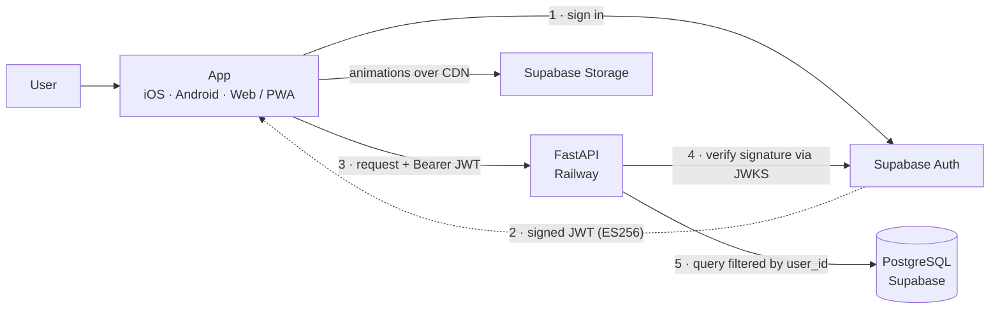

# FitTrack v2

**Track your workouts and your nutrition from a single app, on your phone or in the browser.**

**Language:** [Español](README.md) · English


Keeping the gym and food in separate apps is tedious and ends up abandoned. FitTrack puts both in one place, with the focus on the training itself: the session screen lets you check off sets and correct weight and reps with no friction, while the rest of the app builds progress over time —attendance, volume per muscle group, body weight. For food, you describe the meal by text, photo, or voice and Claude estimates calories and macros; you correct it before saving.

The native app (iOS and Android) and the web version are the same `mobile/` codebase: Expo Router treats the browser as just another platform. The web build installs as a PWA, which reaches iPhone without paying for the Apple Developer Program. Behind it is a custom FastAPI backend and Supabase for data, identity, and files.

A full rebuild of [fittrack](https://github.com/BlasterLc/fittrack), now archived for reference.

---

## Screenshots

<p align="center">
  
  
  
  
</p>

<p align="center"><sub>Home · Session · Progress · Nutrition — Android, dark theme</sub></p>

---

## Features

**Training**
- Custom routines with reorderable exercises.
- A catalog of 1,324 exercises with animations and Spanish instructions, filterable by muscle group and equipment.
- A session screen made for the gym: check off sets and adjust weight and reps on the spot; a new set inherits the previous set's weight.
- Workout history and a per-exercise progression chart.

**Nutrition**
- Describe a meal by text, photo, or voice; Claude estimates calories and macros; the user corrects and confirms before saving.
- Logging and editing of meals from earlier days (up to 7 days back).
- Daily calorie ring with configurable goals.

**Progress**
- Yearly attendance map (contribution-graph style).
- Weekly sets per muscle group against a target range.
- Body-weight trend with an editable history.
- Export of a PDF summary to review or paste into a chat.

**Account**
- Public sign-up with email confirmation and a mandatory onboarding wizard (date of birth, basic data, goals).

---

## Architecture



Two independent runtimes in the same repository: `api/` (FastAPI, on Railway) and `mobile/` (Expo, on Vercel for the web). The client gets its JWT straight from Supabase Auth; the API never issues tokens, it only verifies their signature before responding.

---

## How it works

**One codebase for three platforms.** Expo Router treats the web as just another target, so iOS, Android, and the PWA all come from the same `mobile/`. Bringing the native app to the browser exposed two traps that neither `tsc` nor the bundler catches: `Alert.alert` does nothing in `react-native-web` (solved with a wrapper that uses `window.confirm` on web), and the Supabase client's `localStorage` does not exist during the static Node render that `expo export` performs.

**Delegated identity, in-house verification.** The client requests the JWT straight from Supabase Auth; the API never issues tokens, it only verifies their signature. `api/auth.py` dispatches on the token's algorithm: ES256/RS256 are verified against the project's JWKS (client cached per process), and HS256 is kept only for test tokens, which are signed without touching the network.

**Per-user isolation with no foreign keys.** Every personal table filters by the user's UUID, and the catalog is shared. There are no FKs to the `auth` schema so the test suite can run against a local Postgres that lacks it; in exchange, every id coming from the client is checked as the caller's own before it is used.

**Nutrition with a review step.** The meal description —text, photo, or voice— goes to Claude Haiku, which returns calories and macros. That estimate is never saved on its own: the user corrects and confirms it first.

---

## Stack

- **React Native 0.86 + Expo SDK 57 + Expo Router** — app for iOS, Android, and web/PWA from a single codebase
- **TanStack Query** — server state and client-side cache
- **FastAPI + SQLAlchemy 2.0 + Pydantic v2** — the API
- **Supabase** — PostgreSQL (via the session pooler), Auth, and animation Storage
- **Claude Haiku 4.5** — calorie and macro estimation
- **Railway** — API deploy · **Vercel** — web deploy
- **pytest** — 337 tests against local PostgreSQL, no network

---

## Layout

```
api/       FastAPI backend. Pure API, serves no static files.
  routers/    Endpoints by domain (catalog, food, progress, ...).
  services/   Business logic and data access.
  scripts/    Catalog loading. Run by hand, never on deploy.
mobile/    React Native + Expo app. Web/PWA from the same code.
  src/app/     Routes (Expo Router): (auth), (tabs), session, profile.
  src/components/  Screen components.
  src/theme/   Design tokens (dark theme, Rubik typography).
data/      Versioned catalog (names translated to Spanish).
tests/     Backend tests (pytest).
```

---

## Getting started

### Backend

```bash
python3 -m venv .venv && source .venv/bin/activate
pip install -r requirements.txt
cp .env.example .env        # fill in the values
uvicorn api.main:app --reload
```

Tests run against a local PostgreSQL (`TEST_DATABASE_URL`), never against Supabase. The direct Supabase connection (`db.<ref>.supabase.co`) is IPv6-only and does not work on WSL or Railway: use the **session pooler**.

### App (iOS / Android)

```bash
cd mobile
npm install
cp .env.example .env        # EXPO_PUBLIC_API_URL, EXPO_PUBLIC_SUPABASE_URL, EXPO_PUBLIC_SUPABASE_ANON_KEY
npx expo start              # open with Expo Go (SDK 57)
```

### Web / PWA

```bash
cd mobile
npx expo export --platform web   # builds dist/, served as static files (Vercel)
```

The backend enables CORS for that origin through the `WEB_ORIGIN` variable; if it is not set, nothing changes (local and tests stay as they are).

<details>
<summary>Environment variables and initial catalog load</summary>

### Environment variables

| Variable | Where | Purpose |
|---|---|---|
| `DATABASE_URL` | backend | Supabase Postgres, via the session pooler, `postgresql+psycopg://` prefix |
| `SUPABASE_URL` | backend | Base of the Storage URLs |
| `SUPABASE_JWT_SECRET` | backend | Verifies the signature of test JWTs (HS256) |
| `WEB_ORIGIN` | backend (web) | Allowed origin for the PWA's CORS |
| `ANTHROPIC_API_KEY` | backend | Calorie and macro estimation |
| `TEST_DATABASE_URL` | local only | Local Postgres for the tests |
| `SUPABASE_SERVICE_ROLE_KEY` | local only | Animation upload script; **never in production** |
| `EXPO_PUBLIC_API_URL` | app | Backend URL |
| `EXPO_PUBLIC_SUPABASE_URL` | app | Supabase project |
| `EXPO_PUBLIC_SUPABASE_ANON_KEY` | app | The **public** `anon` key (not `service_role`) |

### Initial catalog load

Run by hand once; not part of startup or deploy.

```bash
python -m api.scripts.descargar     # dataset + 1,324 animations (~123 MB)
python -m api.scripts.ingestar      # catalog into Postgres (idempotent)
python -m api.scripts.subir_gifs    # animations into Supabase Storage (idempotent)
```

`data/nombres_es.json` already ships with the translated names, so `ANTHROPIC_API_KEY` is not needed for the catalog.

</details>

---

## Tests

```bash
.venv/bin/python -m pytest
```

When writing a test, the function is broken on purpose to confirm the test goes red: several mutations survived test suites that looked complete in this project, and that is the recurring gap.

---

## Exercise data

The catalog comes from [hasaneyldrm/exercises-dataset](https://github.com/hasaneyldrm/exercises-dataset).

The animations are owned by **Gym visual** (<https://gymvisual.com/>) and are redistributed with permission, at 180×180 and keeping the attribution. Any use of that material must comply with the [Gym visual terms](https://gymvisual.com/content/3-terms-and-conditions-of-use).

## License

Personal project, no distribution license.
