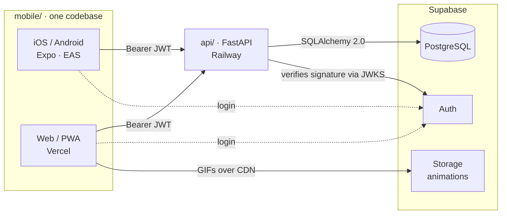

# FitTrack v2

> Workout and nutrition tracking built for the gym. One codebase for **iOS, Android, and web (PWA)**, with AI-based calorie estimation and a custom backend.

**Language:** [Español](README.md) · English


A full rebuild of [fittrack](https://github.com/BlasterLc/fittrack), now archived for reference.

---

## Screenshots

<p align="center">
  
  
  
  
</p>

<p align="center"><sub>Home · Session · Progress · Nutrition — Android, dark theme</sub></p>

---

## What it is

An app to track training and nutrition in one place. The focus is real use inside the gym: the session screen lets you check off sets and correct weight and reps with no friction, while the rest of the app records progress over time.

The same `mobile/` codebase runs on all three platforms (Expo Router treats the web as just another target). The web build ships as an installable PWA, which sidesteps the Apple Developer Program cost to reach iPhone.

## Features

**Training**
- Custom routines with reorderable exercises.
- A catalog of 1,324 exercises with animations and Spanish instructions, filterable by muscle group and equipment.
- A session screen made for the gym: check off sets and adjust weight and reps on the spot; a new set inherits the previous set's weight.
- Workout history and a per-exercise progression chart.

**Nutrition**
- Describe a meal by text, photo, or voice; Claude estimates calories and macros; the user corrects and confirms before saving.
- Logging and editing of meals from earlier days (up to 7 days back).
- Daily calorie ring with configurable goals.

**Progress**
- Yearly attendance map (contribution-graph style).
- Weekly sets per muscle group against a target range.
- Body-weight trend with an editable history.
- Export of a PDF summary to review or paste into a chat.

**Account**
- Public sign-up with email confirmation and a mandatory onboarding wizard (date of birth, basic data, goals).

## Architecture



Two independent runtimes in the same repository. The client gets its JWT straight from Supabase Auth; the API never issues tokens, it only verifies their signature. User isolation is done by `user_id` (the `auth.users` UUID) on every query, with no database-level foreign keys, because the test suite runs against a local Postgres that has no `auth` schema.

## Stack

| Layer | Technology |
|---|---|
| App | React Native 0.86 + Expo SDK 57 + Expo Router (iOS, Android, web/PWA) |
| Server state | TanStack Query |
| API | FastAPI + SQLAlchemy 2.0 + Pydantic v2 |
| Database | Supabase (PostgreSQL), accessed via the session pooler |
| Identity | Supabase Auth — the API verifies the JWT (ES256/RS256 via JWKS), it does not issue it |
| Animations | Supabase Storage, public bucket served over CDN |
| Nutrition | Claude Haiku 4.5 (Anthropic API) |
| Infrastructure | Railway (API) · Vercel (web) · Supabase (data, identity, files) |
| Tests | pytest against local PostgreSQL — 337 tests, no network |

## Engineering notes

- **JWT verification by algorithm.** Supabase signs real tokens with ES256, not with the shared secret. `api/auth.py` dispatches on the `alg` claim: ES256/RS256 are verified against the project's JWKS (client cached per process), and HS256 is kept only for test tokens, which are signed without touching the network.
- **Isolation by `user_id` with no database FK.** Every personal table filters by the user's UUID; the catalog is shared. No foreign keys to the `auth` schema so the test suite can run on a local Postgres without it.
- **Concurrent writes.** A double tap on "Save" fires two requests; services that replace lists use `SELECT ... FOR UPDATE` to avoid duplicating or corrupting the collection.
- **Three platforms from one codebase.** Bringing the native app to the web exposed two silent traps that neither `tsc` nor the bundler catches: `Alert.alert` is a no-op in `react-native-web` (solved with a wrapper that uses `window.confirm` on web), and the Supabase client's `localStorage` does not exist during the static Node render of `expo export`.
- **No migrations.** The deploy does not run Alembic; schema changes are applied by hand against production before the code lands, following a documented runbook. A deliberate choice for a single-author project.
- **Deliberate mutation while testing.** When writing a test, the function is broken on purpose to confirm the test goes red. Nine mutations survived test suites that looked complete in this project; it is the recurring gap.

## Layout

```
api/       FastAPI backend. Pure API, serves no static files.
  routers/    Endpoints by domain (catalog, food, progress, ...).
  services/   Business logic and data access.
  scripts/    Catalog loading. Run by hand, never on deploy.
mobile/    React Native + Expo app. Web/PWA from the same code.
  src/app/     Routes (Expo Router): (auth), (tabs), session, profile.
  src/components/  Screen components.
  src/theme/   Design tokens (dark theme, Rubik typography).
data/      Versioned catalog (names translated to Spanish).
tests/     Backend tests (pytest).
```

## Getting started

### Backend

```bash
python3 -m venv .venv && source .venv/bin/activate
pip install -r requirements.txt
cp .env.example .env        # fill in the values
uvicorn api.main:app --reload
pytest -q                   # 337 tests against local PostgreSQL
```

Tests run against a local PostgreSQL (`TEST_DATABASE_URL`), never against Supabase. The direct Supabase connection (`db.<ref>.supabase.co`) is IPv6-only and does not work on WSL or Railway: use the **session pooler**.

### App (iOS / Android)

```bash
cd mobile
npm install
cp .env.example .env        # EXPO_PUBLIC_API_URL, EXPO_PUBLIC_SUPABASE_URL, EXPO_PUBLIC_SUPABASE_ANON_KEY
npx expo start              # open with Expo Go (SDK 57)
```

### Web / PWA

```bash
cd mobile
npx expo export --platform web   # builds dist/
```

The web build is served as static files (Vercel). The backend enables CORS for that origin through the `WEB_ORIGIN` variable; if it is not set, nothing changes (local and tests stay as they are).

### Environment variables

| Variable | Where | Purpose |
|---|---|---|
| `DATABASE_URL` | backend | Supabase Postgres, via the session pooler, `postgresql+psycopg://` prefix |
| `SUPABASE_URL` | backend | Base of the Storage URLs |
| `SUPABASE_JWT_SECRET` | backend | Verifies the signature of test JWTs (HS256) |
| `WEB_ORIGIN` | backend (web) | Allowed origin for the PWA's CORS |
| `ANTHROPIC_API_KEY` | backend | Calorie and macro estimation |
| `TEST_DATABASE_URL` | local only | Local Postgres for the tests |
| `SUPABASE_SERVICE_ROLE_KEY` | local only | Animation upload script; **never in production** |
| `EXPO_PUBLIC_API_URL` | app | Backend URL |
| `EXPO_PUBLIC_SUPABASE_URL` | app | Supabase project |
| `EXPO_PUBLIC_SUPABASE_ANON_KEY` | app | The **public** `anon` key (not `service_role`) |

### Initial catalog load

Run by hand once; not part of startup or deploy.

```bash
python -m api.scripts.descargar     # dataset + 1,324 animations (~123 MB)
python -m api.scripts.ingestar      # catalog into Postgres (idempotent)
python -m api.scripts.subir_gifs    # animations into Supabase Storage (idempotent)
```

`data/nombres_es.json` already ships with the translated names, so `ANTHROPIC_API_KEY` is not needed for the catalog.

## Exercise data

The catalog comes from [hasaneyldrm/exercises-dataset](https://github.com/hasaneyldrm/exercises-dataset).

The animations are owned by **Gym visual** (<https://gymvisual.com/>) and are redistributed with permission, at 180×180 and keeping the attribution. Any use of that material must comply with the [Gym visual terms](https://gymvisual.com/content/3-terms-and-conditions-of-use).

## License

Personal project, no distribution license.
