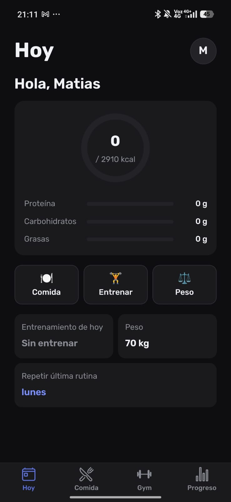
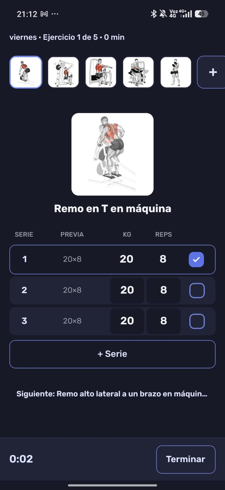
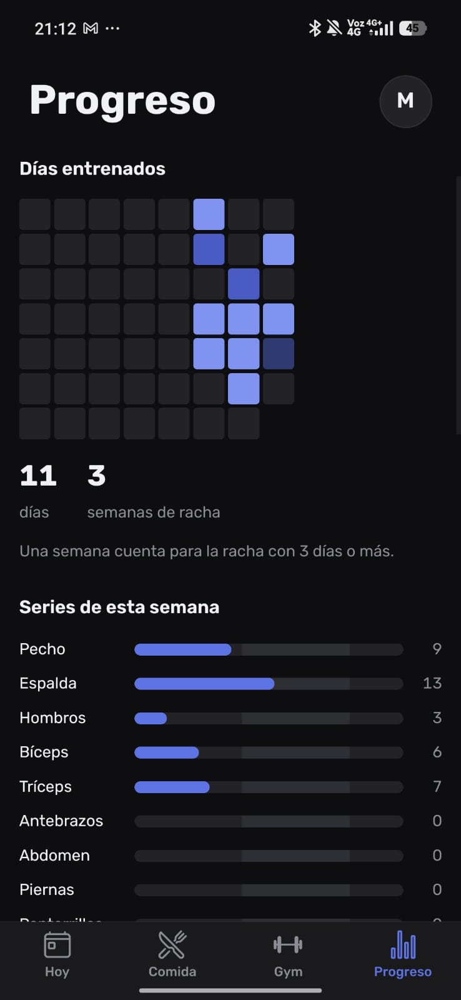
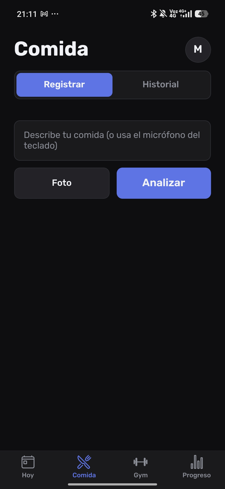
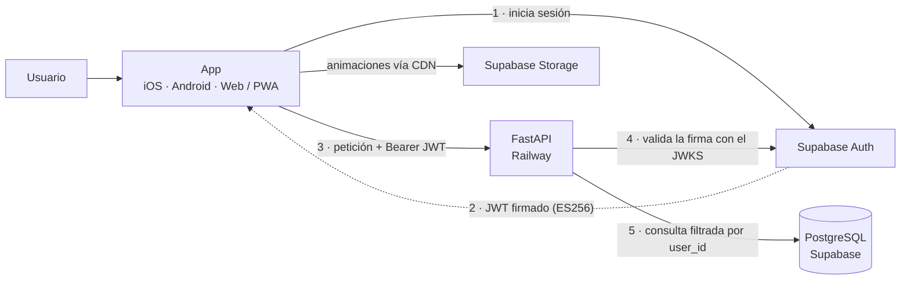

# FitTrack v2

**Registra tus entrenamientos y tu alimentación desde una sola app, en el teléfono o en el navegador.**

**Idioma:** Español · [English](README.en.md)


Llevar el gimnasio y la comida en apps separadas es tedioso y termina abandonado. FitTrack junta las dos cosas con el foco puesto en el momento del entrenamiento: la pantalla de sesión deja marcar series y corregir peso y repeticiones sin fricción, y el resto de la app arma el progreso a lo largo del tiempo —asistencia, volumen por grupo muscular, peso corporal—. Para la comida se describe el plato por texto, foto o voz y Claude estima calorías y macros; el usuario corrige antes de guardar.

La app nativa (iOS y Android) y la versión web son el mismo código de `mobile/`: Expo Router trata el navegador como una plataforma más. La web se instala como PWA, lo que permite llegar a iPhone sin pagar el Apple Developer Program. Detrás hay un backend propio en FastAPI y Supabase para datos, identidad y archivos.

Reconstrucción completa de [fittrack](https://github.com/BlasterLc/fittrack), que queda archivado como referencia.

---

## Capturas

<p align="center">
  
  
  
  
</p>

<p align="center"><sub>Inicio · Sesión · Progreso · Comida — Android, tema oscuro</sub></p>

---

## Funcionalidades

**Entrenamiento**
- Rutinas propias con ejercicios reordenables.
- Catálogo de 1.324 ejercicios con animaciones e instrucciones en español, filtrable por grupo muscular y equipo.
- Pantalla de sesión pensada para el gimnasio: se marcan series y se ajustan peso y repeticiones en el momento; una serie nueva hereda el peso de la anterior.
- Historial de entrenamientos y gráfico de progresión por ejercicio.

**Nutrición**
- Se describe la comida por texto, foto o voz; Claude estima calorías y macros; el usuario corrige y confirma antes de guardar.
- Registro y edición de comidas de días anteriores (hasta 7 días atrás).
- Anillo de calorías del día con metas configurables.

**Progreso**
- Mapa anual de asistencia (estilo _contribution graph_).
- Series semanales por grupo muscular contra un rango objetivo.
- Evolución del peso corporal con historial editable.
- Exportación de un resumen en PDF para revisar o pegar en un chat.

**Cuenta**
- Registro público con confirmación por correo y un asistente de onboarding obligatorio (fecha de nacimiento, datos básicos, metas).

---

## Arquitectura



Dos runtimes independientes en el mismo repositorio: `api/` (FastAPI, en Railway) y `mobile/` (Expo, en Vercel para la web). El cliente obtiene el JWT directamente de Supabase Auth; la API nunca emite tokens, solo valida su firma antes de responder.

---

## Cómo funciona

**Una base de código para tres plataformas.** Expo Router trata la web como un target más, así que iOS, Android y la PWA salen del mismo `mobile/`. Llevar la app nativa al navegador destapó dos trampas que ni `tsc` ni el bundler detectan: `Alert.alert` no hace nada en `react-native-web` (resuelto con un wrapper que usa `window.confirm` en web), y el `localStorage` del cliente de Supabase no existe durante el render estático en Node que hace `expo export`.

**Identidad delegada, verificación propia.** El cliente pide el JWT directamente a Supabase Auth; la API nunca emite tokens, solo valida su firma. `api/auth.py` despacha según el algoritmo del token: ES256/RS256 se verifican contra el JWKS del proyecto (cliente cacheado por proceso), y HS256 queda solo para los tokens de prueba, que se firman sin tocar la red.

**Aislamiento por usuario sin llaves foráneas.** Cada tabla personal filtra por el UUID del usuario y el catálogo es compartido. No hay FK al esquema `auth` para que la batería de pruebas corra contra un Postgres local que no lo tiene; a cambio, todo id que llega del cliente se valida como propio antes de usarse.

**Nutrición con un paso de revisión.** La descripción del plato —texto, foto o voz— va a Claude Haiku, que devuelve calorías y macros. Esa estimación nunca se guarda sola: el usuario la corrige y confirma primero.

---

## Stack

- **React Native 0.86 + Expo SDK 57 + Expo Router** — app para iOS, Android y web/PWA desde un solo código
- **TanStack Query** — estado de servidor y caché en el cliente
- **FastAPI + SQLAlchemy 2.0 + Pydantic v2** — la API
- **Supabase** — PostgreSQL (vía _session pooler_), Auth y Storage de animaciones
- **Claude Haiku 4.5** — estimación de calorías y macros
- **Railway** — despliegue de la API · **Vercel** — despliegue de la web
- **pytest** — 337 pruebas contra PostgreSQL local, sin red

---

## Estructura

```
api/       Backend FastAPI. API pura, no sirve archivos estáticos.
  routers/    Endpoints por dominio (catálogo, comida, progreso, ...).
  services/   Lógica de negocio y acceso a datos.
  scripts/    Carga del catálogo. Se corren a mano, nunca en el deploy.
mobile/    App React Native + Expo. Web/PWA desde el mismo código.
  src/app/     Rutas (Expo Router): (auth), (tabs), sesión, perfil.
  src/components/  Componentes de pantalla.
  src/theme/   Tokens de diseño (tema oscuro, tipografía Rubik).
data/      Catálogo versionado (nombres traducidos al español).
tests/     Pruebas del backend (pytest).
```

---

## Puesta en marcha

### Backend

```bash
python3 -m venv .venv && source .venv/bin/activate
pip install -r requirements.txt
cp .env.example .env        # completar los valores
uvicorn api.main:app --reload
```

Las pruebas corren contra un PostgreSQL local (`TEST_DATABASE_URL`), nunca contra Supabase. La conexión directa a Supabase (`db.<ref>.supabase.co`) es solo IPv6 y no funciona en WSL ni en Railway: hay que usar el **session pooler**.

### App (iOS / Android)

```bash
cd mobile
npm install
cp .env.example .env        # EXPO_PUBLIC_API_URL, EXPO_PUBLIC_SUPABASE_URL, EXPO_PUBLIC_SUPABASE_ANON_KEY
npx expo start              # abrir con Expo Go (SDK 57)
```

### Web / PWA

```bash
cd mobile
npx expo export --platform web   # genera dist/, se sirve como estática (Vercel)
```

El backend habilita CORS para ese origen mediante la variable `WEB_ORIGIN`; si no está definida, no cambia nada (así siguen local y las pruebas).

<details>
<summary>Variables de entorno y carga inicial del catálogo</summary>

### Variables de entorno

| Variable | Dónde | Para qué |
|---|---|---|
| `DATABASE_URL` | backend | Postgres de Supabase, vía _session pooler_, prefijo `postgresql+psycopg://` |
| `SUPABASE_URL` | backend | Base de las URLs de Storage |
| `SUPABASE_JWT_SECRET` | backend | Valida la firma de los JWT de prueba (HS256) |
| `WEB_ORIGIN` | backend (web) | Origen permitido para CORS de la PWA |
| `ANTHROPIC_API_KEY` | backend | Estimación de calorías y macros |
| `TEST_DATABASE_URL` | solo local | Postgres local para las pruebas |
| `SUPABASE_SERVICE_ROLE_KEY` | solo local | Script de subida de animaciones; **nunca en producción** |
| `EXPO_PUBLIC_API_URL` | app | URL del backend |
| `EXPO_PUBLIC_SUPABASE_URL` | app | Proyecto de Supabase |
| `EXPO_PUBLIC_SUPABASE_ANON_KEY` | app | Clave `anon` **pública** (no la `service_role`) |

### Carga inicial del catálogo

Se ejecuta a mano una sola vez; no forma parte del arranque ni del despliegue.

```bash
python -m api.scripts.descargar     # dataset + 1.324 animaciones (~123 MB)
python -m api.scripts.ingestar      # catálogo a Postgres (idempotente)
python -m api.scripts.subir_gifs    # animaciones a Supabase Storage (idempotente)
```

`data/nombres_es.json` ya viene versionado con los nombres traducidos, así que no hace falta `ANTHROPIC_API_KEY` para el catálogo.

</details>

---

## Pruebas

```bash
.venv/bin/python -m pytest
```

Al escribir una prueba se rompe la función a propósito para confirmar que se pone en rojo: en este proyecto varias mutaciones sobrevivieron a baterías que parecían completas, y ese es el hueco recurrente.

---

## Datos de ejercicios

El catálogo proviene de [hasaneyldrm/exercises-dataset](https://github.com/hasaneyldrm/exercises-dataset).

Las animaciones son propiedad de **Gym visual** (<https://gymvisual.com/>) y se redistribuyen con su permiso, a 180×180 y conservando la atribución. Cualquier uso de ese material debe respetar los [términos de Gym visual](https://gymvisual.com/content/3-terms-and-conditions-of-use).

## Licencia

Proyecto personal, sin licencia de distribución.
