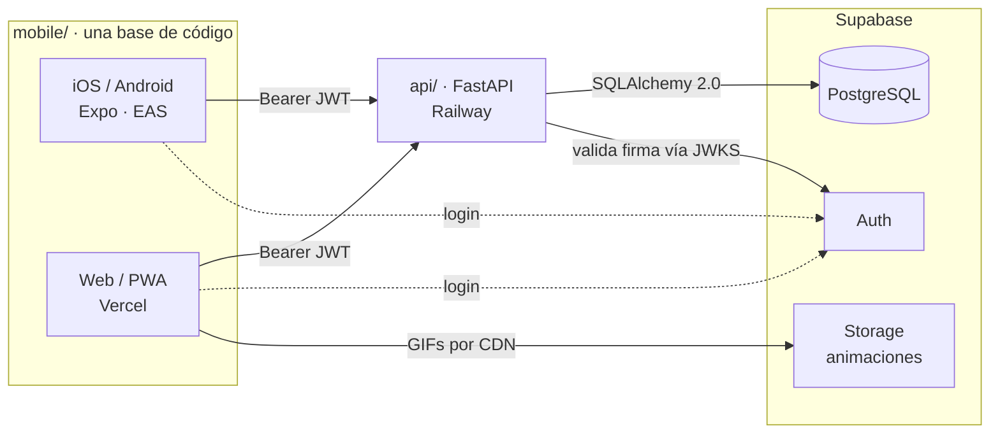

# FitTrack v2

> Seguimiento de entrenamiento y nutrición para el gimnasio. Una sola base de código para **iOS, Android y web (PWA)**, con estimación de calorías por IA y un backend propio.

**Idioma:** Español · [English](README.en.md)


Reconstrucción completa de [fittrack](https://github.com/BlasterLc/fittrack), que queda archivado como referencia.

---

## Capturas

<!--
TODO capturas. Tomar 3-4 desde el teléfono (Android, tema oscuro) y guardarlas
en docs/capturas/ con estos nombres. Formato recomendado: PNG a ancho real del
teléfono, o un GIF corto para la sesión.

  docs/capturas/inicio.png      — pantalla Inicio: racha, anillo de calorías, accesos directos
  docs/capturas/sesion.png      — sesión en el gimnasio: marcar series, ajustar peso/reps
  docs/capturas/progreso.png    — Progreso: mapa anual de asistencia + series por grupo muscular
  docs/capturas/comida.png      — registrar comida: descripción por texto/foto/voz, macros estimados

Una vez guardadas, reemplazar esta tabla por las imágenes reales.
-->

| Inicio | Sesión | Progreso | Comida |
|:---:|:---:|:---:|:---:|
| _pendiente_ | _pendiente_ | _pendiente_ | _pendiente_ |

---

## Qué es

Una app para llevar el gimnasio y la alimentación en un mismo lugar. El foco es el uso real dentro del gimnasio: la pantalla de sesión permite marcar series y corregir peso y repeticiones sin fricción, y el resto de la app registra el progreso a lo largo del tiempo.

El mismo código de `mobile/` corre en las tres plataformas (Expo Router trata la web como un target más). La versión web se despliega como PWA instalable, lo que evita el costo del Apple Developer Program para llegar a iPhone.

## Funcionalidades

**Entrenamiento**
- Rutinas propias con ejercicios reordenables.
- Catálogo de 1.324 ejercicios con animaciones e instrucciones en español, filtrable por grupo muscular y equipo.
- Pantalla de sesión pensada para el gimnasio: se marcan series y se ajustan peso y repeticiones en el momento; una serie nueva hereda el peso de la anterior.
- Historial de entrenamientos y gráfico de progresión por ejercicio.

**Nutrición**
- Se describe la comida por texto, foto o voz; Claude estima calorías y macros; el usuario corrige y confirma antes de guardar.
- Registro y edición de comidas de días anteriores (hasta 7 días atrás).
- Anillo de calorías del día con metas configurables.

**Progreso**
- Mapa anual de asistencia (estilo _contribution graph_).
- Series semanales por grupo muscular contra un rango objetivo.
- Evolución del peso corporal con historial editable.
- Exportación de un resumen en PDF para revisar o pegar en un chat.

**Cuenta**
- Registro público con confirmación por correo y un asistente de onboarding obligatorio (fecha de nacimiento, datos básicos, metas).

## Arquitectura



Dos runtimes independientes en el mismo repositorio. El cliente obtiene el JWT directamente de Supabase Auth; la API nunca emite tokens, solo valida su firma. El aislamiento entre usuarios se hace por `user_id` (UUID de `auth.users`) en cada consulta, sin claves foráneas a nivel de base de datos, porque las pruebas corren contra un Postgres local que no tiene el esquema `auth`.

## Stack

| Capa | Tecnología |
|---|---|
| App | React Native 0.86 + Expo SDK 57 + Expo Router (iOS, Android, web/PWA) |
| Estado de servidor | TanStack Query |
| API | FastAPI + SQLAlchemy 2.0 + Pydantic v2 |
| Base de datos | Supabase (PostgreSQL), acceso vía _session pooler_ |
| Identidad | Supabase Auth — la API valida el JWT (ES256/RS256 vía JWKS), no lo emite |
| Animaciones | Supabase Storage, bucket público servido por CDN |
| Nutrición | Claude Haiku 4.5 (API de Anthropic) |
| Infraestructura | Railway (API) · Vercel (web) · Supabase (datos, identidad y archivos) |
| Pruebas | pytest sobre PostgreSQL local — 337 pruebas, sin red |

## Decisiones técnicas

- **Verificación de JWT por algoritmo.** Supabase firma los tokens reales con ES256, no con el secreto compartido. `api/auth.py` despacha según el claim `alg`: ES256/RS256 se validan contra el JWKS del proyecto (cliente cacheado por proceso), y HS256 queda solo para los tokens de prueba, que se firman sin tocar la red.
- **Aislamiento por `user_id` sin FK de base de datos.** Cada tabla personal filtra por el UUID del usuario; el catálogo es compartido. Sin claves foráneas al esquema `auth` para que la batería de pruebas corra en un Postgres local sin ese esquema.
- **Escrituras concurrentes.** Un doble toque en "Guardar" manda dos requests; los servicios que reemplazan listas usan `SELECT ... FOR UPDATE` para no duplicar ni corromper la colección.
- **Tres plataformas desde un código.** Llevar la app nativa a la web expuso dos trampas silenciosas que ni `tsc` ni el _bundler_ detectan: `Alert.alert` es un _no-op_ en `react-native-web` (resuelto con un wrapper que usa `window.confirm` en web) y el `localStorage` del cliente de Supabase no existe durante el render estático en Node del `expo export`.
- **Sin migraciones.** El despliegue no corre Alembic; los cambios de esquema se aplican a mano contra producción antes de que el código llegue, con un runbook documentado. Decisión consciente para un proyecto de un solo autor.
- **Pruebas con mutación deliberada.** Al escribir una prueba se rompe la función a propósito para confirmar que se pone en rojo. En este proyecto sobrevivieron nueve mutaciones a baterías que parecían completas; es el hueco recurrente.

## Estructura

```
api/       Backend FastAPI. API pura, no sirve archivos estáticos.
  routers/    Endpoints por dominio (catálogo, comida, progreso, ...).
  services/   Lógica de negocio y acceso a datos.
  scripts/    Carga del catálogo. Se corren a mano, nunca en el deploy.
mobile/    App React Native + Expo. Web/PWA desde el mismo código.
  src/app/     Rutas (Expo Router): (auth), (tabs), sesión, perfil.
  src/components/  Componentes de pantalla.
  src/theme/   Tokens de diseño (tema oscuro, tipografía Rubik).
data/      Catálogo versionado (nombres traducidos al español).
tests/     Pruebas del backend (pytest).
```

## Puesta en marcha

### Backend

```bash
python3 -m venv .venv && source .venv/bin/activate
pip install -r requirements.txt
cp .env.example .env        # completar los valores
uvicorn api.main:app --reload
pytest -q                   # 337 pruebas contra PostgreSQL local
```

Las pruebas corren contra un PostgreSQL local (`TEST_DATABASE_URL`), nunca contra Supabase. La conexión directa a Supabase (`db.<ref>.supabase.co`) es solo IPv6 y no funciona en WSL ni en Railway: hay que usar el **session pooler**.

### App (iOS / Android)

```bash
cd mobile
npm install
cp .env.example .env        # EXPO_PUBLIC_API_URL, EXPO_PUBLIC_SUPABASE_URL, EXPO_PUBLIC_SUPABASE_ANON_KEY
npx expo start              # abrir con Expo Go (SDK 57)
```

### Web / PWA

```bash
cd mobile
npx expo export --platform web   # genera dist/
```

La build web se sirve como estática (Vercel). El backend habilita CORS para ese origen mediante la variable `WEB_ORIGIN`; si no está definida, no cambia nada (así siguen local y las pruebas).

### Variables de entorno

| Variable | Dónde | Para qué |
|---|---|---|
| `DATABASE_URL` | backend | Postgres de Supabase, vía _session pooler_, prefijo `postgresql+psycopg://` |
| `SUPABASE_URL` | backend | Base de las URLs de Storage |
| `SUPABASE_JWT_SECRET` | backend | Valida la firma de los JWT de prueba (HS256) |
| `WEB_ORIGIN` | backend (web) | Origen permitido para CORS de la PWA |
| `ANTHROPIC_API_KEY` | backend | Estimación de calorías y macros |
| `TEST_DATABASE_URL` | solo local | Postgres local para las pruebas |
| `SUPABASE_SERVICE_ROLE_KEY` | solo local | Script de subida de animaciones; **nunca en producción** |
| `EXPO_PUBLIC_API_URL` | app | URL del backend |
| `EXPO_PUBLIC_SUPABASE_URL` | app | Proyecto de Supabase |
| `EXPO_PUBLIC_SUPABASE_ANON_KEY` | app | Clave `anon` **pública** (no la `service_role`) |

### Carga inicial del catálogo

Se ejecuta a mano una sola vez; no forma parte del arranque ni del despliegue.

```bash
python -m api.scripts.descargar     # dataset + 1.324 animaciones (~123 MB)
python -m api.scripts.ingestar      # catálogo a Postgres (idempotente)
python -m api.scripts.subir_gifs    # animaciones a Supabase Storage (idempotente)
```

`data/nombres_es.json` ya viene versionado con los nombres traducidos, así que no hace falta `ANTHROPIC_API_KEY` para el catálogo.

## Datos de ejercicios

El catálogo proviene de [hasaneyldrm/exercises-dataset](https://github.com/hasaneyldrm/exercises-dataset).

Las animaciones son propiedad de **Gym visual** (<https://gymvisual.com/>) y se redistribuyen con su permiso, a 180×180 y conservando la atribución. Cualquier uso de ese material debe respetar los [términos de Gym visual](https://gymvisual.com/content/3-terms-and-conditions-of-use).

## Licencia

Proyecto personal, sin licencia de distribución.
